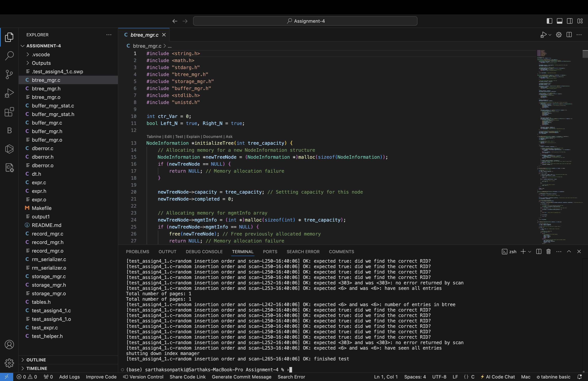

## BTree Manager:-

In this assignment we are going to implement a B+-tree index backed by a page file, with pages accessed through a buffer manager. Each node of the B+-tree fits within a single page, enabling efficient storage and retrieval. The tree supports a smaller fan-out for debugging while still occupying one page per node. Keys in the B+-tree are used to index pointers to records (RIDs) for quick access, making it an essential structure for fast data lookups and updates.

## Folder structure:-

- dberror.h: RC code errors with their definitions are mentioned in this file.

- dberror.c: Functions such as errorMessage and printError are mentioned in this file.

- storage_mgr.h: This file defines SM_PageHandle and provides a structure and attributes for SM_FileHandle. It declares functions for reading, writing, and manipulating files.

- storage_mgr.c: This file contains the methods of the functions mentioned in the storage_mgr.h file. 

- test_helper.h: A set of macros needed for testing is defined in this file.

- expr.c: This file contains the  all functions which defines data structures and functions to deal with expressions for scans.

- expr.h: This file contains the data structures and functions to deal with expressions for scans.

- test_expr.c: This file is used for several test cases using the expr.h interface.

- test_assign4_1.c: This file is used for several test cases using the btree_mgr interface.

- Makefile: This file gets created on running ‘make’ command which is used to produce the binary test_assign1 from test_assign4_1.c.

- buffer_mgr_stat.c: This file declares many functions for displaying buffer or page content to console.

- buffer_mgr_stat.h: This file provides implementation for the functions declared in buffer_mgr_stat.h

- buffer_mgr.h: This file defines the structure of the buffer pool and declares functions for buffer pool management.

buffer_mgr.c : This file contains the methods of the functions mentioned in the buffer_mgr.h file.

- dt.h: This file also defines set of macros used for testing purpose.

- record_mgr.h: TThis header file defines the interface for interacting with the Record Manager module, including function prototypes and type definitions, enabling developers to use Record Manager functionality in their programs.

- record_mgr.c: This source file implements the functionality specified in record_mgr.h, providing operations for managing records, pages, and concurrency control within a database system, facilitating efficient data storage and retrieval.

- rm_serializer.c: Manages serialization in Record Manager.

- tables.h: Defines and serializes schemas, tables, records, and values.

- btree_mgr.h: Interface for B-tree operations.

- btree_mgr.c: Implements B-tree manager functions, including balancing and traversal.

- Readme.txt: Detailed description of the program is mentioned 

## Functions:-

1. Index Manager Functions:

    1.1. initIndexManager: Sets up the B-tree manager, allocating required resources and initializing structures for B-tree operations.
    1.2. shutdownIndexManager: Cleans up and releases memory, properly shutting down the B-tree manager.

2. B Tree Functions:

    2.1. createBtree: Creates a new B-tree by allocating memory for its components and initializing a page file to store its data.
    2.2. openBtree: Opens the page file linked to the specified B-tree index ID to access stored tree data.
    2.3. closeBtree: Closes the B-tree, freeing memory and resources.
    2.4. deleteBtree: Empties all entries and data in the B-tree, resetting it to its initial state.

3. Index Access Functions:

    3.1. getNumNodes: Returns the number of nodes currently present in the B-tree for reference purposes.
    3.2. getNumEntries: Provides the total count of data entries stored within the B-tree.
    3.3. getKeyType: Retrieves the type of keys used in the B-tree, ensuring data is interpreted correctly.

4. Key Functions:

    4.1. findKey: Searches the B-tree to locate a specific key and its associated data.
    4.2. insertKey: Inserts a new key into the B-tree, preserving its structure and balance.
    4.3. deleteKey: Removes a given key and its data, ensuring the B-tree structure remains intact.

5. Scan Functions:

    5.1. openTreeScan: Begins a scan across the B-tree, allowing sequential access to all entries.
    5.2. nextEntry: Progresses through the B-tree, returning each subsequent entry in the scan.
    5.3. closeTreeScan: Ends the scan, releasing any resources used during traversal.

### Procedures for Implementation:

1) Navigate to the project folder.
2) Open the terminal in the project folder / VS code or any other IDE.
3) Run the below command to clear any pre-existin executable run files
```
make clean
```
4) Then run the below code to create fresh executable files
```
make
```
5) To test the program run the below command in your terminal
```
make run
```
## Outputs:-

