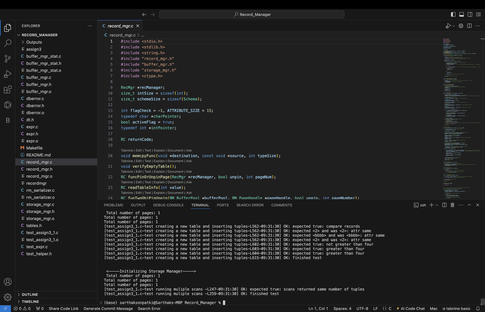

## CS 525 ADO Assignment - 3 - Record Manager - Group 36

Team Members and their Contribution:

Bhavana  Polakala - A20539792, bpolakala@hawk.iit.edu, 33.33 %

Sarthak Sonpatki -  A20579456, ssonpatki@hawk.iit.edu, 33.33 %	

Vishwas Ramakrishna - A20552892, vramakrishna@hawk.iit.edu, 33.33 %		

## Record Manager:-

The Record Manager is designed to manage tables with a fixed schema, offering core functionality like inserting, deleting, 
updating records, and scanning the table. Scans are tailored to specific conditions, returning only records that meet the criteria. 
To ensure efficiency, the manager focuses on proper memory handling by releasing allocated resources when no longer needed and 
minimizing unnecessary variables throughout the implementation.

## Folder contents:-

dberror.h: RC code errors with their definitions are mentioned in this file.

dberror.c: Functions such as errorMessage and printError are mentioned in this file.

storage_mgr.h: This file defines SM_PageHandle and provides a structure and attributes for SM_FileHandle. It declares functions for reading, writing, and manipulating files.

storage_mgr.c: This file contains the methods of the functions mentioned in the storage_mgr.h file. 

test_helper.h: A set of macros needed for testing is defined in this file.

expr.c: This file contains the  all functions which defines data structures and functions to deal with expressions for scans.

expr.h: This file contains the data structures and functions to deal with expressions for scans.

test_expr.c: This file is used for several test cases using the expr.h interface.

test_assign3_1.c: This file is used for several test cases using the record mgr.h interface.

Makefile: This file gets created on running ‘make’ command which is used to produce the binary test_assign1 from test_assign3_1.c.

buffer_mgr_stat .c: This file declares many functions for displaying buffer or page content to console.

buffer_mgr_stat .h: This file provides implementation for the functions declared in buffer_mgr_stat.h

buffer_mgr.h: This file defines the structure of the buffer pool and declares functions for buffer pool management.

buffer_mgr.c : This file contains the methods of the functions mentioned in the buffer_mgr.h file.

dt.h: This file also defines set of macros used for testing purpose.

record_mgr.h: This header file defines the interface for interacting with the Record Manager module, including function prototypes and type definitions, enabling developers to use Record Manager functionality in their programs.

record_mgr.c: This source file implements the functionality specified in record_mgr.h, providing operations for managing records, pages, and concurrency control within a database system, facilitating efficient data storage and retrieval.

README.md: Detailed description of the program is mentioned 

## Functions:-

1. Table and Record Manager Functions:

    1.1. initRecordManager - Initializes the record manager, setting the active flag to false and calling the storage manager initialization function.

    1.2. shutdownRecordManager - Cleans up the record manager by shutting down the buffer pool, freeing the record manager structure, and resetting the active flag.

    1.3. createTable - Creates a new table with the specified name and schema. It allocates memory for the record manager, initializes the buffer pool, and writes the schema information to the first page of the table.

    1.4. openTable - Opens an existing table by pinning its first page, retrieving the schema and other metadata, and assigning it to the provided relation structure.

    1.5. closeTable - Closes the specified table by shutting down its buffer pool and resetting the active flag.

    1.6. deleteTable - Deletes the specified table by destroying the associated page file if the record manager is active.

    1.7 getNumTuples - Returns the total number of tuples (records) in the specified table, retrieved from the record manager structure.

2. Record Functions:

    2.1. insertRecord - Adds a new record to the table. It first collects metadata about the record manager and the record size. If the size is zero, it retrieves the record size from the schema, assigns a page for the record, and pins the page. Next, it locates a slot for the new record, marks it as dirty, and unpins the page once the operation is complete. Finally, it pins the first page of the table.

    2.2. deleteRecord - Removes a record from the table. This function pins the page that contains the record, fetches the page data, determines the record's position on the page, and marks it as deleted by replacing its content with a '-'. It then marks the page as dirty and forces the changes to be written to disk.

    2.3. updateRecord - Modifies an existing record in the table. It pins the page where the record is located, retrieves the record size, checks its validity, updates the relevant data, marks the page as dirty, and finally unpins the page after the update.

    2.4. getRecord - Fetches a record from the table. It pins the page containing the record, obtains the record size, and initializes necessary variables. It then checks the validity of the record marker, copies the record data if valid, unpins the page, and reads the table if needed.

3. Scan Functions:

    3.1. startScan - Initializes the scan handler with the associated table and the specified scan condition.

    3.2. next - Returns the record that matches the scan condition. It evaluates whether the record meets the specified criteria and only returns it if it does. The function tracks the number of records scanned and retrieves the next record upon subsequent calls.

    3.3. closeScan - Closes the scan handler.

4. Schema Functions:

    4.1. createSchema - Constructs the schema using the provided parameters.

    4.2. freeSchema - Deallocates the schema and frees the memory assigned to it to prevent memory leaks.

    4.3. getRecordSize - Returns the size of the record based on the schema.

5. Attribute Functions:

    5.1. createRecord - Allocates memory for a new Record structure and initializes it according to the provided schema.

    5.2. freeRecord - Deallocates memory associated with a Record structure and any dynamically allocated fields to prevent memory leaks.

    5.3. getAttr - Retrieves the value of a specified attribute from a record based on the given schema.

    5.4. setAttr - Sets the value of a specified attribute within a record according to the provided schema.

### Procedures for Implementation:

1) Navigate to the project folder.
2) Open the terminal in the project folder / VS code or any other IDE.
3) Run the below command to clear any pre-existin executable run files
```
make clean
```
4) Then run the below code to create fresh executable files
```
make
```
5) To test the program run the below command in your terminal
```
./recordmgr
```
## Outputs:-

