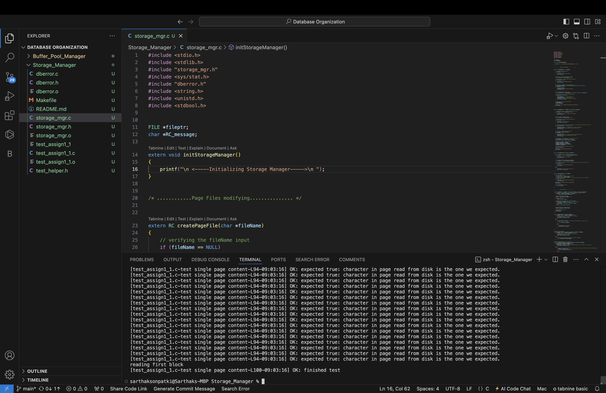

# Storage Manager:-

This assignment uses file manipulation techniques to read, write and retrieve data/pages. The pages are stored in the disk in memory and required to be pulled through to perform above mentioned operations.

# Folder Contents:-

 dberror.h: RC code errors with their definitions are mentioned in this file.

 dberror.c: Functions such as errorMessage and printError are mentioned in this file.

storage_mgr.h: This file defines SM_PageHandle and provides a structure and attributes for SM_FileHandle. It declares functions for reading, writing, and manipulating files.

storage_mgr.c: This file contains the methods of the functions mentioned in the storage_mgr.h file. 

test_helper.h: A set of macros needed for testing is defined in this file.

test_assign1_1.c: The methods mentioned in this file are  testSinglePageContent and testCreateOpenClose which are used test the program.

 Makefile: This file gets created on running ‘make’ command which is used to produce the binary test_assign1 from test_assign1_1.c.

 Readme.txt: Detailed description of the program is mentioned 
  
# Functions

1) extern void initStorageManager (void):
This function initiates up the application for the storage manager.

2) extern RC createPageFile (char *fileName):
This function initializes a newly created page file called with a blank page. If everything goes well, it returns RC_OK; if not, it returns an error code, as RC_ERROR in the case of a failed file creation or RC_WRITE_FAILED in the case of a problem writing data into the file. 

3) extern RC openPageFile (char *fileName, SM_FileHandle *fHandle):
This function loads an existing page file, obtains its contents, including its current location and number of pages, and adds it into our 'fHandle' structure. It returns RC_FILE_NOT_FOUND if the file cannot be located. An effective opening yields RC_OK.

4) extern RC closePageFile (SM_FileHandle *fHandle):
With the file handle 'fHandle' offered, this method shuts an open page file connected with it. If the file is properly closed, it returns RC_OK; if not, it returns RC_ERROR.

5) extern RC destroyPageFile (char *fileName):
Using 'remove', this function removes (wipes out) the page file with the name 'fileName'. If it is successful, RC_OK is returned. If there are any problems with the deletion, RC_ERROR is returned.

6) extern RC readBlock (int pageNum, SM_FileHandle *fHandle, SM_PageHandle memPage):
The function is used to read the block and store the data in memPage and also store the current position of the page in the fileptr pointer.

7) extern int getBlockPos (SM_FileHandle *fHandle):
The function is used to get the current position of the block. 

8) extern RC readFirstBlock (SM_FileHandle *fHandle, SM_PageHandle memPage):
The function is used to read the first block in the disk. 

9) extern RC readPreviousBlock (SM_FileHandle *fHandle, SM_PageHandle memPage):
The function is used to read the previous block based on the current page position.

10) extern RC readCurrentBlock (SM_FileHandle *fHandle, SM_PageHandle memPage):
This function is used to read the contents of the current page based on the pointer.

11) extern RC readNextBlock (SM_FileHandle *fHandle, SM_PageHandle memPage):
The function is used to read the next block based on the current page position.

12) extern RC readLastBlock (SM_FileHandle *fHandle, SM_PageHandle memPage):
The function is used to read the last block in the disk.

13) extern RC writeBlock (int pageNum, SM_FileHandle *fHandle, SM_PageHandle memPage):
The writeBlock function handles validations and error checking for seek positions and write operations, writing the contents of a memory page to a given page number in a file. 


14) extern RC writeCurrentBlock (SM_FileHandle *fHandle, SM_PageHandle memPage):
The goal of this method is to write and save the contents of the memPage on the current page. If there are any problems finding the necessary position or writing the contents, it returns the relevant error indicators.

15) extern RC appendEmptyBlock (SM_FileHandle *fHandle)
The goal of this strategy is to produce more pages. Here, the file is sought to its conclusion, an empty block is allocated and written, and the number of pages is increased by one.

16) extern RC ensureCapacity (int numberOfPages, SM_FileHandle *fHandle)
This technique adds empty blocks for the necessary additional number of pages after determining whether there is enough space to hold the given number of pages.

### Procedures for Implementation:

1) Navigate to the project folder.
2) Open the terminal in the project folder / VS code or any other IDE.
3) Run the below command to clear any pre-existin executable run files
```
make clean
```
4) Then run the below code to create fresh executable files
```
make
```
5) To test the program run the below command in your terminal
```
./test_assign1_1   
```
## Outputs:-


